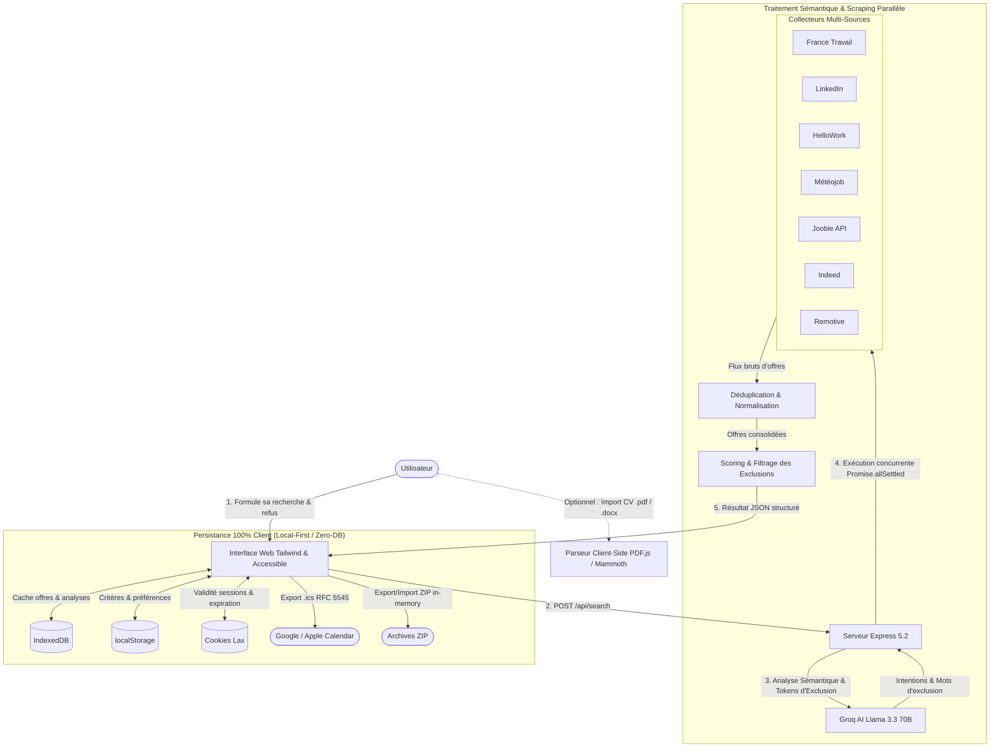

<div align="center">

# 🎯 FindTheJob

**Le métamoteur de recherche d'emploi nouvelle génération : multi-sources, filtrage sémantique strict des exclusions par IA (Groq), analyse de CV locale & suivi complet de candidatures.**

[](https://nodejs.org)
[](https://expressjs.com)
[](https://groq.com)
[](https://www.docker.com)
[](https://developer.mozilla.org/en-US/docs/Web/API/IndexedDB_API)
[](https://www.numerique.gouv.fr/publications/rgaa-accessibilite/)
[](LICENSE)

<br/>

[Fonctionnalités](#-fonctionnalités-clés) •
[Architecture](#-architecture--flux-de-données) •
[Démarrage Rapide](#-démarrage-rapide-en-2-minutes) •
[Configuration](#-variables-denvironnement) •
[Scénarios d'Usage](#-guide-dutilisation-par-scénarios) •
[API REST](#-référence-de-lapi-rest) •
[Déploiement Docker](#-déploiement--docker)

<br/>

> **FindTheJob** met fin à la surcharge d'offres non pertinentes. Il interroge simultanément **7 plateformes d'emploi**, applique un **filtrage sémantique intelligent pour éliminer radicalement tout ce que vous refusez**, et offre un **espace candidat complet (CV, calendrier, export .ics, archives ZIP)** garanti **100% respectueux de la vie privée (Zero-DB)**.

</div>

---

## ⚡ Pourquoi FindTheJob ?

La recherche d'emploi classique souffre de trois maux majeurs :
1. **La dispersion** : Les offres sont éparpillées entre LinkedIn, France Travail, HelloWork, Indeed, Météojob, Remotive...
2. **L'inefficacité des filtres de négation** : Sur la plupart des job boards, taper `-stage` ou `-alternance` renvoie quand même ces offres, polluant votre temps de veille.
3. **Le manque de confidentialité** : La plupart des plateformes stockent vos CVs, vos démarches et revendent vos données de recherche.

**FindTheJob** résout ces trois points :
- 🌐 **Unification temps réel** : Une seule requête interroge tous les canaux en parallèle (avec support natif de la France Métropolitaine, des DROM : 974, 971, 972, 973, 976, et de l'Europe).
- 🧠 **Compréhension sémantique par IA** : Le LLM (Groq Llama 3.3 70B / compound-mini) décline morphologiquement vos critères de refus (variantes lexicales, formes fléchies, synonymes) pour exclure chirurgicalement les offres indésirables.
- 🔒 **Local-First par conception** : Zéro base de données serveur requise. Vos offres, candidatures, entretiens et critères CV sont stockés exclusivement dans votre navigateur (IndexedDB + localStorage + Cookies).

---

## ✨ Fonctionnalités Clés

### 1. 🔍 Scraping Multi-Sources Parallèle
- **Couverture exhaustive** : Interrogation simultanée via `Promise.allSettled` de :
  - **France Travail** (Module dédié avec gestion des codes départements et tri pertinence)
  - **LinkedIn Jobs** (Filtres natifs sur temps de parution, type de contrat et travail à distance)
  - **HelloWork** (Offres France et DROM)
  - **Météojob** (Flux emploi sans friction anti-bot)
  - **Indeed** (Scraper modulaire par mots-clés et géolocalisation)
  - **Jooble** (Support natif de l'API REST officielle)
  - **Remotive** (Offres Tech internationales et Full Remote Europe / Mondial)
- **Déduplication intelligente** : Signature normalisée titre/entreprise et filtrage des doublons inter-plateformes.

### 2. 🧠 Moteur d'Intention & d'Exclusion Sémantique (Groq AI)
- Découpage en 2 volets clairs :
  - **Ce que vous cherchez concrètement** (intitulé, technos, expérience, salaire, télétravail).
  - **Ce que vous refusez formellement** (technologies rédhibitoires, types de contrat, ESN, quartiers/villes).
- Traitement par l'IA Groq en **quelques millisecondes** pour extraire les tokens d'exclusion et calculer un score d'adéquation (0 à 100%).
- Mode de repli heuristique autonome si aucune clé d'API Groq n'est fournie.

### 3. 📄 Analyse & Matching CV (Local-First + Groq)
- **Extraction 100% locale** : Analyse de fichiers `.pdf` (via PDF.js), `.docx` (via Mammoth.js) ou `.txt` exécutée dans le navigateur.
- **Dictionnaire déterministe** : Détection instantanée de plus de 60 technologies et frameworks (Node, React, Python, Symfony, Cloud, SQL...).
- **Enrichissement Groq optionnel** :
  - Identification des soft skills, formations et synthèses de carrière.
  - Diagnostic RH automatisé : *Points positifs du profil* & *Axes d'optimisation du CV*.
  - Calcul du score d'affinité avec chaque offre scrapée.
- **Avertissement RGPD clair** : Aucune donnée de votre CV n'est persistée sur le serveur ni utilisée pour l'entraînement de modèles.

### 4. 📋 Gestionnaire de Candidatures & Entretiens
- **Suivi des étapes** : Envoi de candidature, relance, entretiens, propositions, refus.
- **Vue Calendrier interactive** : Visualisation mensuelle intégrée de vos échéances et convocations.
- **Export iCalendar (`.ics`) standard RFC 5545** : Synchronisation en un clic avec Google Calendar, Microsoft Outlook et Apple Calendar.
- **Sauvegarde d'archives ZIP sécurisées** : Export/Import complet de vos candidatures et historiques, compressés et décompressés en mémoire (JSZip) sans passage par un serveur.

### 5. ♿ Accessibilité & Ergonomie 2026
- Interface Tailwind CSS moderne, épurée et ultra-réactive.
- Balisage accessible certifié (règles RGAA / WCAG 2.1 AA : skip-links clavier, rôles ARIA, contrastes validés).
- Bascule fluide entre vue **DataTable paginée** et vue **Cartes interactives**.

---

## 🏗 Architecture & Flux de Données



---

## 🚀 Démarrage Rapide en 2 Minutes

### Prérequis
- [Node.js](https://nodejs.org/) v20.x ou v24.x (avec npm)
- *Optionnel* : [Docker & Docker Compose](https://www.docker.com/)

### Installation Locale

1. **Cloner le projet :**
   ```bash
   git clone https://github.com/SteveHoareau18/findthejob.git
   cd findthejob
   ```

2. **Installer les dépendances :**
   ```bash
   npm install
   ```

3. **Créer le fichier `.env` :**
   ```bash
   cp .env.example .env
   ```

4. **Lancer l'application :**
   ```bash
   # Mode développement avec rechargement automatique (Node --watch)
   npm run dev

   # Ou mode standard
   npm start
   ```

5. **Accéder à l'application :**
   Ouvrez [http://localhost:3000](http://localhost:3000) dans votre navigateur.

---

## ⚙️ Variables d'Environnement

Configurez votre fichier `.env` à la racine :

| Variable | Description | Valeur par défaut / Exemple | Requis ? |
| :--- | :--- | :--- | :---: |
| `PORT` | Port d'écoute du serveur Node.js | `3000` | Non |
| `GROQ_API_KEY` | Clé d'API Groq (obtenable gratuitement sur [Groq Console](https://console.groq.com)) | `gsk_...` | Recommandé *(active l'IA)* |
| `GROQ_MODEL` | Modèle de traitement sémantique Groq | `llama-3.3-70b-versatile` *(ou `groq/compound-mini`)* | Non |
| `JOOBLE_API_KEY` | Clé d'API Jooble REST (obtenable en 30s sur [Jooble API](https://jooble.org/api/about)) | `votre_clé_jooble` | Non *(optionnel)* |

> [!TIP]
> **Mode sans clé API (Fallback Heuristique)** : Si vous lancez l'application sans `GROQ_API_KEY`, FindTheJob bascule automatiquement en mode heuristique par regex déterministe. Vous pouvez tester toutes les fonctionnalités de scraping sans aucune clé !

---

## 📖 Guide d'Utilisation par Scénarios

### 🎯 Scénario 1 : Recherche chirurgicale avec exclusions strictes
1. Dans le champ **« Ce que vous cherchez »**, écrivez librement :
   > *Développeur Fullstack React / Node.js, au moins 3 ans d'expérience, télétravail partiel ou total.*
2. Dans le champ **« Ce que vous refusez »**, indiquez vos critères rédhibitoires :
   > *Pas de PHP, pas de WordPress, aucun stage ni contrat d'alternance, pas d'ESN ni prestation.*
3. Sélectionnez le périmètre géographique souhaité (**France**, **DROM 974/971...**, **Europe** ou **Tous**).
4. Cliquez sur **Rechercher** : Groq élimine les formes fléchies associées et classe les offres prioritaires avec badge vert.

### 📄 Scénario 2 : Adaptation automatique au profil CV
1. Glissez-déposez votre CV (`.pdf`, `.docx` ou `.txt`) dans la zone d'étape 1.
2. Le navigateur extrait immédiatement vos technologies clés en local.
3. Cliquez sur **✨ Adapter les critères avec Groq\*** :
   - L'IA synthétise votre profil.
   - Vous obtenez les **Points positifs** et **Conseils d'amélioration RH**.
   - Le moteur évalue l'adéquation de chaque offre vis-à-vis de votre CV.

### 📅 Scénario 3 : Suivi des candidatures et export Agenda (.ics)
1. Sur une offre qui vous intéresse, cliquez sur **« Postuler »**.
2. L'offre est automatiquement enregistrée dans votre espace **« Voir mes candidatures »**.
3. Définissez la date et l'heure d'un entretien (RH, Technique, Visio).
4. Consultez vos entretiens dans l'onglet **Vue Calendrier**.
5. Cliquez sur **« 📅 Exporter vers mon calendrier (.ics) »** pour ajouter automatiquement l'événement à Google Calendar ou Outlook !

### 💾 Scénario 4 : Sauvegarde & Restauration d'Archives ZIP
- Cliquez sur **« 📦 Exporter archive ZIP »** pour télécharger une archive chiffrable et portable contenant l'ensemble de vos données.
- Changez d'ordinateur ou de navigateur et restaurez vos données en important votre fichier `.zip` sans jamais passer par un serveur centralisé.

---

## 🔌 Référence de l'API REST

| Méthode | Route | Description | Corps de requête (JSON) |
| :--- | :--- | :--- | :--- |
| `GET` | `/api/status` | Vérifie la santé du serveur et la détection de la clé Groq | *Aucun* |
| `POST` | `/api/search` | Lance le parsing sémantique, le scraping multi-sources et le scoring | `{ query, exclusions, geoRegion, cvCriteria }` |
| `POST` | `/api/jobs/analyze` | Analyse approfondie d'une offre (résumé, profil recherché, conseils pour postuler) | `{ job: { title, company, url, description, ... } }` |
| `POST` | `/api/cv/adapt-groq` | Analyse sémantique d'un texte de CV et structuration des critères | `{ cvText: "Contenu texte du CV..." }` |
| `POST` | `/api/cv/score-jobs` | Réévalue le score d'adéquation d'une liste d'offres face aux critères CV | `{ jobs: [...], cvCriteria: { ... } }` |

<details>
<summary><b>Exemple d'appel cURL pour <code>/api/search</code></b> (cliquer pour dérouler)</summary>

```bash
curl -X POST http://localhost:3000/api/search \
  -H "Content-Type: application/json" \
  -d '{
    "query": "Développeur TypeScript Node.js",
    "exclusions": "Pas de PHP, pas de stage",
    "geoRegion": "france"
  }'
```
</details>

---

## 🐳 Déploiement & Docker

L'application fournit un `Dockerfile` multi-stage optimisé (Node 24 Alpine), des configurations Docker Compose prêtes à l'emploi et une image pré-construite publiée automatiquement via CI/CD sur **GitHub Container Registry (GHCR)**.

### 📦 Utilisation de l'image GHCR (Recommandé)

#### 1. Télécharger l'image (`docker pull`)
```bash
docker pull ghcr.io/stevehoareau18/findthejob:latest
```

> [!NOTE]
> *Si le package est en visibilité privée sur votre dépôt GitHub, connectez-vous préalablement avec un Personal Access Token (PAT) doté du scope `read:packages` :*
> ```bash
> echo $GH_PAT | docker login ghcr.io -u SteveHoareau18 --password-stdin
> ```

#### 2. Lancer le conteneur (`docker run`)

**Option A : En utilisant votre fichier `.env` existant**
```bash
docker run -d \
  --name findthejob \
  -p 3000:3000 \
  --env-file .env \
  --restart unless-stopped \
  ghcr.io/stevehoareau18/findthejob:latest
```

**Option B : En passant les variables d'environnement en ligne de commande**
```bash
docker run -d \
  --name findthejob \
  -p 3000:3000 \
  -e GROQ_API_KEY="votre_cle_groq" \
  --restart unless-stopped \
  ghcr.io/stevehoareau18/findthejob:latest
```

L'application est immédiatement accessible sur **http://localhost:3000**.

#### 3. Commandes utiles
```bash
# Suivre les logs en temps réel
docker logs -f findthejob

# Arrêter et supprimer le conteneur
docker stop findthejob && docker rm findthejob
```

---

### 🛠️ Construction locale avec Docker Compose

#### Mode Développement (avec hot-reload & volume monté en direct)
```bash
docker compose -f dev.compose.yml up --build
```

#### Mode Production locale
```bash
docker compose up -d --build
```

> [!IMPORTANT]
> **Déploiement Production & France Travail** :
> En environnement de production à fort trafic, il est vivement recommandé d'utiliser l'API officielle [francetravail.io](https://francetravail.io) avec des identifiants OAuth 2.0 certifiés plutôt que le scraping direct des pages publiques, afin d'éviter les restrictions d'adresses IP et les quotas d'accès.

---

## 🛡️ Sécurité, Confidentialité & RGPD

- 🔒 **Zéro Base de Données Centralisée** : Aucune de vos candidatures, notes ou informations personnelles n'est enregistrée dans une base de données distante.
- 🧹 **Assainissement anti-XSS** : Tous les flux scrapés et fichiers importés passent par des mécanismes stricts d'échappement HTML (`cheerio`, DOMPurify, validation des schémas).
- 🤝 **Engagements Inférence IA (Groq)** : Lorsque vous sollicitez l'analyse Groq, les flux transitent par des canaux chiffrés TLS. Les données ne sont ni conservées par Groq, ni commercialisées, ni réutilisées pour réentraîner des modèles publics.

---

## 🗺️ Roadmap & Perspectives

- [x] Agrégation concurrente 7 sources (LinkedIn, France Travail, HelloWork, Météojob, Indeed, Jooble, Remotive).
- [x] Détection géographique France, DROM (974, 971, 972, 973, 976) et Europe.
- [x] Extraction locale de CV (PDF/Docx/TXT) et matching Groq Llama 3.3.
- [x] Gestionnaire de candidatures avec vue calendrier et export `.ics`.
- [x] Export et import d'archives ZIP 100% en mémoire.
- [ ] Connecteur direct OAuth 2.0 pour l'API partenaire officielle France Travail.
- [x] Générateur de lettres de motivation personnalisées adaptées à chaque offre via Groq.
- [ ] Mode PWA (Progressive Web App) pour consultation et gestion des alertes hors-ligne.

---

## 🤝 Contribution

Les contributions, signalements de bugs et suggestions d'améliorations sont les bienvenus !

1. Forkez le dépôt : `git checkout -b feature/ma-nouvelle-fonctionnalite`
2. Validez vos modifications : `git commit -m 'feat: ajout d un nouveau scraper'`
3. Poussez sur votre branche : `git push origin feature/ma-nouvelle-fonctionnalite`
4. Ouvrez une **Pull Request**.

---

## 📄 Licence

Ce projet est distribué sous licence libre **ISC**. Consultez le fichier [LICENSE](LICENSE) pour plus de détails.

---

<div align="center">
  Développé avec passion par <a href="https://github.com/SteveHoareau18"><b>SteveHoareau18</b></a> • Conçu pour booster votre carrière 🚀
  <br/><br/>
  🐛 <b>Un problème ou une suggestion ?</b> <a href="https://github.com/SteveHoareau18/findthejob/issues/new">Cliquez ici pour signaler un bug</a>
</div>